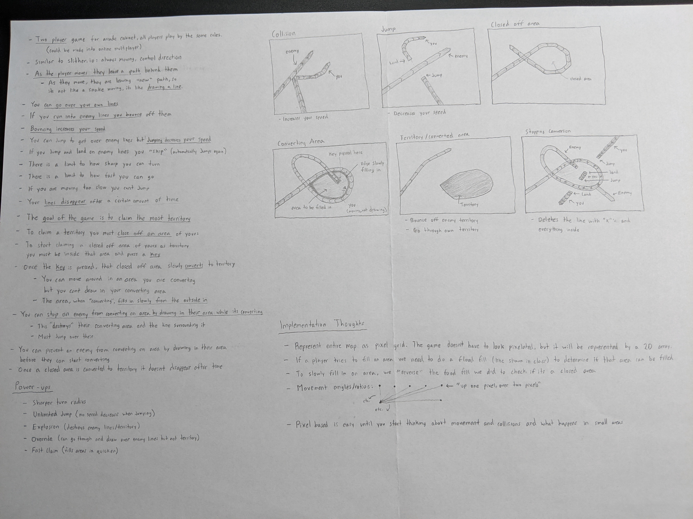

- Zachary Balda
- Nathalie Kroeker

### How to Play
Wildfire is a two player game. Each player is always moving and can adjust their speed as well as turn. While moving, a player draws a line where they have been. A player can draw over their own lines, but if a player goes over an enemy line they lose health. To avoid jumping over enemy lines, a player can try to jump. Items will spawn on the playing field and players will race to pick them up. Some items may clear out an enemies drawing, other may give a player more health. The goal is to stay alive longer than the enemy to beat them.

Player 1
- Movement: WASD
- Jump: Spacebar

Player 2
- Movement: Arrow keys
- Jump: Enter

### Game Design

### Software Engineering Plan
Our responsibilities overlapped in most areas and we often did pair programming. We worked together on most things, but we still each had our areas of focus.

Nathalie Kroeker
 - Planning and design
 - Drawing, jumping, collisions
 - Two player functionality
 - Item spawning and affects
 - Custom map design

Zachary Balda
 - Planning and design
 - Camera tracking, map generation
 - HUD, menu
 - Deep learning generated music
 - Documentation

Proposed Timeline
 - Nov 14 - Nov 19: Brainstorming and planning
 - Nov 19 - Nov 26: Art, music, game design document, learn Godot
 - Nov 26 - Dec 10: Build game, documentation
   - By Nov 29: Drawing, jumping, collisions
   - By Dec 6: Two player, items, health, HUD, menu
   - By Dec 10: Documentation

Actual timeline
 - Nov 14 - 22: Brainstorming and planning
 - Nov 22 - 29: Game design document, learn Godot
 - Dec 2 - 10: Build game, documentation
  - By Dec 9: Drawing, jumping, collisions
  - By Dec 9: Two player, items, health, HUD, menu
  - By Dec 10: Documentation

We found that when pulling new or changed files from git, Godot sometimes would not recognize the new files. This made it hard to quickly share work between ourselves, so we opted to pair program when we could.

### State Transition Diagram
Please show a simple state transition diagram describing the various states in your game and how the transitions between these states occur.
